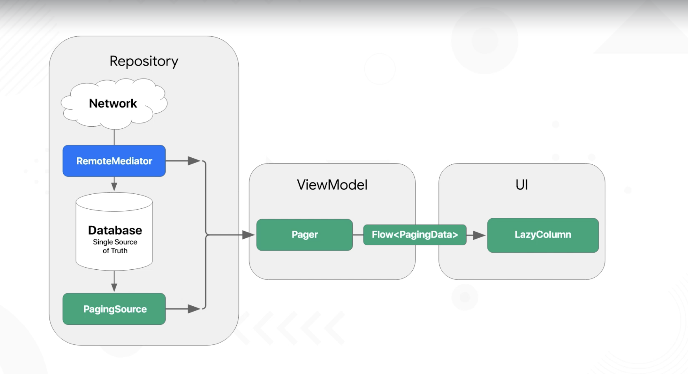
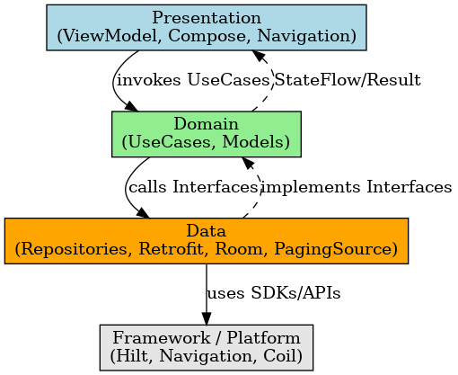

### Android Jetpack Compose Clean Architecture :)

# Android Jetpack Compose Clean Architecture 🧱

Este projeto demonstra uma arquitetura moderna em Android utilizando **Jetpack Compose**, **Clean Architecture**, **Hilt**, **Room**, **Retrofit** e outros componentes essenciais do ecossistema Jetpack.

---

## 🧠 Arquitetura Utilizada

Este projeto segue os princípios da **Clean Architecture**, separando responsabilidades em camadas bem definidas:

      +-------------------------+
      |     Presentation        | ← Jetpack Compose, ViewModel
      +-------------------------+
                 ↓
      +-------------------------+
      |        Domain           | ← UseCases, Entities (sem dependências)
      +-------------------------+
                 ↓
      +-------------------------+
      |         Data            | ← Repository, Retrofit, Room, Paging3
      +-------------------------+
                 ↓
      +-------------------------+
      |       Framework         | ← Hilt, Navigation, Coil, etc.
      +-------------------------+


---

## 📂 Exemplo da Arquitetura

MVVM Architecture with RemoteMediator and Paging3:


Clean Architecture with Jetpack Compose:


## 🔧 Camadas no Projeto

| Camada | Conteúdo |
|--------|----------|
| `presentation` | UI em Jetpack Compose, navegando com Navigation Compose, e interagindo via ViewModel |
| `domain` | Regras de negócio com UseCases e Models puros |
| `data` | Implementações de Repositories, DAOs (Room), Retrofit, PagingSource |
| `di` | Módulos de Hilt para injeção de dependências |
| `db` | Configuração do Room e DAOs |
| `network` | Fonte de dados remota via Retrofit |
| `model` | Entidades compartilhadas entre camadas |

---

## 📦 Funcionalidades

- 🔍 Campo de busca com debounce
- 📃 Paginação de usuários com `PagingData`
- ❤️ Favoritar e listar favoritos via Room
- 🌐 Consumo de API REST com Retrofit
- 🧠 Gerenciamento de estado com ViewModel + StateFlow
- 💉 Injeção de dependência com Hilt

---

## 🛠 Tecnologias

- [Kotlin](https://kotlinlang.org/)
- [Jetpack Compose](https://developer.android.com/jetpack/compose)
- [Coroutines & Flow](https://kotlinlang.org/docs/flow.html)
- [ViewModel](https://developer.android.com/topic/libraries/architecture/viewmodel)
- [StateFlow](https://developer.android.com/kotlin/flow/stateflow-and-sharedflow)
- [Hilt](https://dagger.dev/hilt/)
- [Room](https://developer.android.com/jetpack/androidx/releases/room)
- [Retrofit](https://square.github.io/retrofit/)
- [Paging 3](https://developer.android.com/topic/libraries/architecture/paging/v3-overview)
- [Coil](https://github.com/coil-kt/coil)
- [Accompanist](https://google.github.io/accompanist/)

---

## 🚀 Executando o Projeto

```bash
git clone https://github.com/JorgeDanilo/androd-jetpack-compose-clean-archicture``
```

## <br/><br/>Built With 🛠
- [Kotlin](https://kotlinlang.org/)
- [Coroutines](https://kotlinlang.org/docs/reference/coroutines-overview.html)
- [Compose](https://developer.android.com/jetpack/compose)
- [Navigation](https://developer.android.com/guide/navigation)
- [Android Architecture Components](https://developer.android.com/topic/libraries/architecture)
    - [LiveData](https://developer.android.com/topic/libraries/architecture/livedata)
    - [ViewModel](https://developer.android.com/topic/libraries/architecture/viewmodel)
- [Hilt](https://dagger.dev/hilt/)
- [Retrofit](https://square.github.io/retrofit/)
- [GSON](https://github.com/google/gson)
- [Coil](https://github.com/chrisbanes/accompanist/blob/main/coil/README.md)
- [Accompanist](https://google.github.io/accompanist/)
- [Material Components for Android](https://github.com/material-components/material-components-android) 

